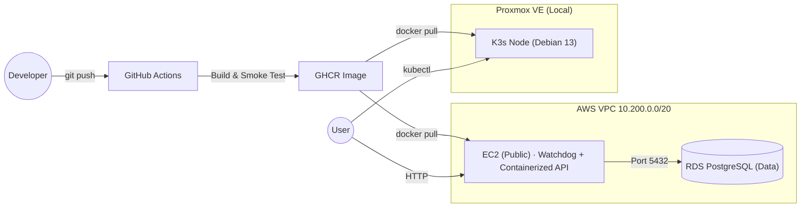

# Infrastructure Lab

[](https://github.com/Upwind1647/infrastructure-lab/actions/workflows/docker-builder.yml)
[](https://upwind1647.github.io/infrastructure-lab/)
[](https://github.com/Upwind1647/infrastructure-lab/blob/main/LICENSE)

This repository serves as a project to showcase modern infrastructure provisioning, security hardening, and cloud-native deployments. It is designed to be fully reproducible, secure by default, and treated as Infrastructure as Code (IaC).

> **Full documentation:** [upwind1647.github.io/infrastructure-lab](https://upwind1647.github.io/infrastructure-lab/)

---

## Architecture Overview



---

## Project Phases

| # | Phase | Focus | Status |
|---|-------|-------|--------|
| 1 | **Local Infrastructure** | Proxmox LXC, Bash hardening, systemd service | Done |
| 2 | **Cloud Architecture** | AWS VPC, Subnets, EC2 | Done |
| 3 | **Containerization** | Multi-stage Dockerfile, CI/CD -> GHCR, Watchdog | Done |
| 4 | **IaC** | OpenTofu for VPC, EC2, and RDS provisioning | Done |
| 5 | **Orchestration** | K3s on Proxmox VM, Ingress | Done |
| 6 | **Persistence & Data Ops**| PV/PVC, Redis Backup & DR | Done |
| 7 | **Ingress & DNS-01**| Traefik, cert-manager, DNS-01 Challenge | Done |
| 8 | **Package Management** | Helm Chart, Templates | Done |
| 9 | **GitOps** | ArgoCD App-of-Apps reconciliation | In Progress |
| 10 | **GitOps Secrets** | Sealed Secrets, encrypted token delivery | In Progress |

---

## Tech Stack

| Layer | Tools |
|-------|-------|
| **Infrastructure** | Proxmox VE, AWS (VPC, EC2, RDS) |
| **IaC & Automation** | Bash, GitOps, OpenTofu, Cloud-Init, uv, Helm |
| **CI/CD** | GitHub Actions, GHCR |
| **Containerization** | Docker, systemd, Watchdog |
| **Backend** | Python, FastAPI, Uvicorn |
| **Networking & Edge** | AWS Security Groups, Kubernetes Ingress (Traefik) |
| **Security & Testing** | UFW, pre-commit, Trivy, pytest |
| **Orchestration** | Kubernetes (K3s), kubectl |

---

## Prerequisites

| Tool | Purpose |
|------|---------|
| `git` | Clone the repository |
| `docker` | Run the containerized API locally |
| `python 3.12+` | Local development & MkDocs |
| `curl` | Bootstrap script & health checks |
| `tofu` | OpenTofu CLI for Infrastructure as Code |
| `aws-cli` | AWS authentication and management |
| `kubectl` | Manage the Kubernetes cluster |
| `helm` | Deploy and manage Kubernetes packages |

---

## Quickstart

### Option A: Run the container locally

```bash
docker run -d --name status-api \
  -p 8000:8000 \
  -e APP_ENV=dev \
  ghcr.io/upwind1647/status-api:<SHORT_SHA>

curl http://localhost:8000/health
```

### Option B: Full server bootstrap (Debian LXC / EC2)

**1. Harden the server** *(run as root)*

```bash
apt update && apt install -y curl \
  && curl -O https://raw.githubusercontent.com/Upwind1647/infrastructure-lab/main/scripts/setup_me.sh \
  && bash setup_me.sh
```

**2. Deploy the application** *(as `adminsetup`)*

```bash
git clone git@github.com:Upwind1647/infrastructure-lab.git && cd infrastructure-lab
bash scripts/deploy.sh
```

**3. Verify**

```bash
curl http://localhost:8000
# → {"message":"Hello from the Infrastructure Lab!","env":"production"}
```

### Option C: Proxmox K3s Cluster via OpenTofu

**1. Provision Infrastructure & Apps**
```bash
cd terraform/proxmox
tofu init
tofu apply -auto-approve
```

**2. Configure Local Kubectl Access**
```bash
export K3S_IP="<YOUR_VM_IP>"
mkdir -p ~/.kube
ssh adminsetup@$K3S_IP "cat /home/adminsetup/.kube/config" > ~/.kube/config
chmod 600 ~/.kube/config
kubectl get nodes
```

**3. Install ArgoCD (Helm)**
```bash
bash scripts/install_argocd.sh
```

**4. Bootstrap the full cluster state via App of Apps**
```bash
kubectl apply -f gitops/apps/root.yaml
kubectl -n argocd get applications
```

**5. Verify encrypted secret delivery and app health**
```bash
kubectl -n argocd get applications sealed-secrets platform-secrets cert-manager cluster-issuers
kubectl -n cert-manager get secret cloudflare-api-token-secret
kubectl -n external-dns get secret cloudflare-api-token-secret
```

**6. Verify ArgoCD UI and workload ingress**
```bash
kubectl get ingress -A
# ArgoCD UI: https://argocd.lab.northlift.net
```

---

## Repository Structure

```
.
├── deploy/                 # systemd units & watchdog scripts
├── docs/                   # MkDocs documentation source
├── helm/                   # Helm Charts for Kubernetes deployments
├── scripts/                # Bash scripts for CI/CD & Server Hardening
├── terraform/              # IaC (OpenTofu)
│   ├── AWS/                # VPC, EC2, RDS
│   └── proxmox/            # K3s Node (Proxmox local)
├── tests/                  # Unit tests (pytest)
├── app.py                  # FastAPI application entrypoint
└── Dockerfile              # Multi-stage production build
```

---

## Key Design Decisions

Detailed Architecture Decision Records (ADRs) are maintained in the [documentation](https://upwind1647.github.io/infrastructure-lab/):

* **[ADR-001](https://upwind1647.github.io/infrastructure-lab/phase1/adr-001-hardening-script/):** Bash over Ansible for constrained bootstrapping
* **[ADR-002](https://upwind1647.github.io/infrastructure-lab/phase2/aws-clickops-deployment/):** Manual AWS validation over immediate Terraform automation
* **[ADR-003](https://upwind1647.github.io/infrastructure-lab/phase3/containerization/):** Cloud-native CI builds over local `docker build`
* **[ADR-004](https://upwind1647.github.io/infrastructure-lab/phase3/adr-004-workload-architecture):** Container Workload Architecture & Watchdog
* **[ADR-005](https://upwind1647.github.io/infrastructure-lab/phase4/adr-005-managed-database/):** Managed Database (AWS RDS) vs. Self-Hosted EC2
* **[ADR-006](https://upwind1647.github.io/infrastructure-lab/phase5/adr-006-k3s/):** Lightweight Kubernetes (K3s) on Proxmox VM
* **[ADR-007](https://upwind1647.github.io/infrastructure-lab/phase5/adr-007-proxmox-iac/):** Infrastructure as Code for Proxmox
* **[ADR-008](https://upwind1647.github.io/infrastructure-lab/phase6/adr-008-persistence/):** Redis Persistence & DR
* **[ADR-009](https://upwind1647.github.io/infrastructure-lab/phase7/adr-009-ingress-tls/):** Traefik Ingress
* **[ADR-010](https://upwind1647.github.io/infrastructure-lab/phase7/adr-010-dns01/):** Cloudflare DNS-01
* **[ADR-011](https://upwind1647.github.io/infrastructure-lab/phase8/adr-011-helm-packaging/):** Helm Package Management
* **[ADR-012](https://upwind1647.github.io/infrastructure-lab/phase8/adr-012-redis-helm/):** First-Party Redis Helm Chart
* **[ADR-013](https://upwind1647.github.io/infrastructure-lab/phase9/adr-013-gitops-argocd/):** GitOps with ArgoCD
* **[ADR-014](https://upwind1647.github.io/infrastructure-lab/phase10/adr-014-gitops-secrets-management-with-sealed-secrets/):** GitOps Secrets Management with Sealed Secrets
