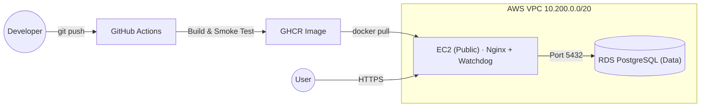

# Infrastructure Lab

[](https://github.com/Upwind1647/infrastructure-lab/actions/workflows/docker-builder.yml)
[](https://upwind1647.github.io/infrastructure-lab/)
[](https://github.com/Upwind1647/infrastructure-lab/blob/main/LICENSE)

This repository serves as a project to showcase modern infrastructure provisioning, security hardening, and cloud-native deployments. It is designed to be fully reproducible, secure by default, and treated as Infrastructure as Code (IaC).

> **Full documentation:** [upwind1647.github.io/infrastructure-lab](https://upwind1647.github.io/infrastructure-lab/)

---

## Architecture Overview



---

## Project Phases

| # | Phase | Focus | Status |
|---|-------|-------|--------|
| 1 | **Local Infrastructure** | Proxmox LXC, Bash hardening, systemd service | Done |
| 2 | **Cloud Architecture** | AWS VPC, Subnets, EC2, Nginx + TLS | Done |
| 3 | **Containerization** | Multi-stage Dockerfile, CI/CD → GHCR, Watchdog | Done |
| 4 | **IaC** | OpenTofu for VPC & EC2 provisioning | Done |
| 5 | **Orchestration** | K3s in Private Subnet, Ingress Controller | Planned |

---

## Tech Stack

| Layer | Tools |
|-------|-------|
| **Infrastructure** | Proxmox VE, AWS (VPC, EC2, RDS) |
| **IaC & Automation** | Bash, GitOps, OpenTofu |
| **CI/CD** | GitHub Actions, GHCR |
| **Containerization** | Docker (multi-stage), systemd, Watchdog |
| **Backend** | Python, FastAPI, Uvicorn |
| **Reverse Proxy & TLS** | Nginx, Certbot (Let's Encrypt) |
| **Security & Testing** | UFW, pre-commit, Trivy, pytest |

---

## Prerequisites

| Tool | Purpose |
|------|---------|
| `git` | Clone the repository |
| `docker` | Run the containerized API locally |
| `python 3.12+` | Local development & MkDocs |
| `curl` | Bootstrap script & health checks |
| `tofu` | OpenTofu CLI for Infrastructure as Code |
| `aws-cli` | AWS authentication and management |

---

## Quickstart

### Option A — Run the container locally

```bash
docker run -d --name status-api \
  -p 8000:8000 \
  -e APP_ENV=dev \
  ghcr.io/upwind1647/status-api:<SHORT_SHA>

curl http://localhost:8000/health
```

### Option B — Full server bootstrap (Debian LXC / EC2)

**1. Harden the server** *(run as root)*

```bash
apt update && apt install -y curl \
  && curl -O https://raw.githubusercontent.com/Upwind1647/infrastructure-lab/main/scripts/setup_me.sh \
  && bash setup_me.sh
```

**2. Deploy the application** *(as `adminsetup`)*

```bash
git clone git@github.com:Upwind1647/infrastructure-lab.git && cd infrastructure-lab
bash scripts/deploy.sh
```

**3. Verify**

```bash
curl http://localhost:8000
# → {"message":"Hello from the Infrastructure Lab!","env":"production"}
```

---

## Repository Structure

```
.
├── app.py                          # FastAPI application
├── Dockerfile                      # Multi-stage production build
├── requirements.app.txt            # Runtime dependencies (pinned)
├── requirements.txt                # Dev dependencies (MkDocs, etc.)
├── deploy/
│   └── status-api.service          # systemd unit (runs watchdog)
├── scripts/
│   ├── setup_me.sh                 # Server hardening & provisioning
│   ├── deploy.sh                   # Zero-downtime deployment script
│   └── watchdog.py                 # Container health monitor ("Poor Man's Kubelet")
├── tests/                          # Unit tests (pytest)
├── docs/                           # MkDocs source files
├── terraform/                      # OpenTofu IaC definitions
│   ├── network.tf                  # VPC & Subnet topology
│   ├── compute.tf                  # EC2 Bastion host
│   ├── database.tf                 # RDS PostgreSQL instance
│   └── security.tf                 # Security Groups
├── docs/                           # MkDocs source files
├── .github/workflows/
│   ├── docker-builder.yml          # Build, test & push to GHCR
│   └── publish_docs.yml            # Deploy docs to GitHub Pages
└── .pre-commit-config.yaml         # Linting & secret scanning hooks

```

---

## Key Design Decisions

Detailed Architecture Decision Records (ADRs) are maintained in the [documentation](https://upwind1647.github.io/infrastructure-lab/):

* **[ADR-001](https://upwind1647.github.io/infrastructure-lab/phase1/adr-001-hardening-script/):** Bash over Ansible for constrained bootstrapping
* **[ADR-003](https://upwind1647.github.io/infrastructure-lab/phase3/containerization/):** Cloud-native CI builds over local `docker build`
* **[ADR-004](https://upwind1647.github.io/infrastructure-lab/phase3/adr-004-workload-architecture):** Container Workload Architecture & Watchdog
* **[ADR-005](https://upwind1647.github.io/infrastructure-lab/phase4/adr-005-managed-database/):** Managed Database (AWS RDS) vs. Self-Hosted EC2
