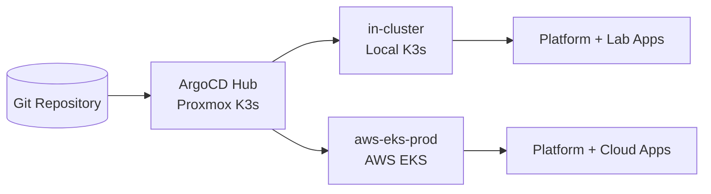

# ADR 019: Hybrid GitOps and Multi-Cluster Architecture

## Context

Phase 10 established GitOps maturity on the local K3s platform and Phase 11 moved Cloudflare controls into IaC.

The next maturity step is a hybrid Hub-and-Spoke model:

1. Keep the local ArgoCD instance on Proxmox as the Hub control plane.
2. Manage both local `in-cluster` and remote `aws-eks-prod` as destinations from one GitOps control plane.
3. Prove multi-cluster workload delivery by deploying `status-api` with cloud-specific values on EKS.

## Decision

We adopt a Hub-and-Spoke GitOps architecture:

1. Hub: on-prem ArgoCD (Proxmox K3s) remains the management cluster.
2. Spokes: `in-cluster` (local workloads) and `aws-eks-prod` (remote cloud workloads).
3. ArgoCD Applications keep environment-specific destinations and values overlays while sharing one source-of-truth repository.

### Feynman Check

#### Why does ArgoCD run on-prem and not inside EKS?

1. Cost: a dedicated EKS management cluster would add fixed control-plane cost before any workload value is delivered.
2. Management Cluster Pattern: the control plane is isolated from workload clusters to reduce coupling.
3. Blast Radius: EKS incident risk is contained to the cloud spoke and does not remove the reconciliation engine itself.
4. Disaster Recovery: if AWS is degraded, the on-prem hub remains reachable and able to manage local services.

#### What happens to GitOps when cloud is down?

1. Local GitOps continues: `in-cluster` reconciliation remains active because ArgoCD and K3s control plane are local.
2. Remote GitOps pauses: `aws-eks-prod` sync attempts fail or become degraded until cloud API recovery.
3. Platform continuity is preserved for local services because the Hub does not depend on EKS runtime availability.

### Service Classification

| Service | Classification | Exposure Model | Primary Destination |
|---|---|---|---|
| `status-api-lab` | Public | Ingress + DNS (`lab.northlift.net`) | `in-cluster` |
| `status-api-cloud` | Public | Ingress + DNS (`aws.northlift.net`) | `aws-eks-prod` |
| `argocd-server` | Tunnel-only | Cloudflare Tunnel + Access | `in-cluster` |
| `redis` | Internal-only | ClusterIP only, no external ingress | `in-cluster` / `aws-eks-prod` |

### Architecture Diagram



## Operational Registration Flow

```bash
aws eks update-kubeconfig \
    --name infrastructure-lab-eks-prod \
    --region eu-central-1 \
    --alias aws-eks-prod

argocd cluster add aws-eks-prod --name aws-eks-prod --grpc-web
argocd cluster list
```

## Consequences

### Positive

1. One control plane governs two Kubernetes targets with consistent Git workflows.
2. Cloud rollout does not require moving or rebuilding the existing ArgoCD control plane.
3. Local operations remain available during cloud outages.
4. Cluster-specific policy and capacity can diverge without splitting repositories.

### Negative

1. Cross-environment release coordination becomes more complex (different health states per destination).
2. ArgoCD must maintain secure credentials for a remote cluster.
3. Remote destination failures can increase noise in ArgoCD alerts.
4. A documented bootstrap/runbook is mandatory for cluster registration and teardown.

## Status

Accepted and implemented in Phase 12.
