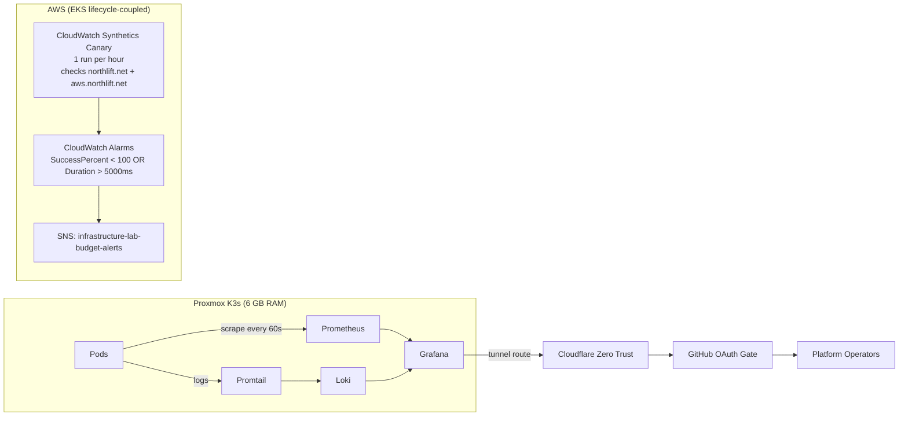

# Phase 13: Full-Picture Observability

Phase 13 introduces a dual-layer observability strategy:

1. Whitebox observability inside K3s with Prometheus + Loki + Grafana.
2. Blackbox uptime validation from AWS with CloudWatch Synthetics.

## Architecture



## Resource Budget

### K3s Observability Limits

| Component | Requests | Limits | Notes |
|---|---|---|---|
| Prometheus | 100m CPU / 192Mi | 300m CPU / 256Mi | Retention 3d, scrape interval 60s |
| Grafana | 50m CPU / 64Mi | 150m CPU / 128Mi | Includes Loki datasource |
| Alertmanager | 20m CPU / 32Mi | 50m CPU / 64Mi | Minimal alert routing footprint |
| kube-state-metrics | 20m CPU / 32Mi | 50m CPU / 64Mi | Cluster object state metrics |
| node-exporter | 10m CPU / 16Mi | 30m CPU / 32Mi | Host/node-level metrics |
| Loki | 50m CPU / 64Mi | 150m CPU / 128Mi | Retention 72h, PVC capped at 5Gi |
| Promtail | 10m CPU / 16Mi | 30m CPU / 32Mi | DaemonSet log shipping |

### Capacity Baseline

| Item | Memory Estimate |
|---|---:|
| K3s platform baseline | ~1.6 Gi |
| Observability stack | ~650 Mi |
| OS safety buffer | ~400 Mi |
| Total baseline | ~2.65 Gi |
| VM provisioned memory | 6.0 Gi |
| Remaining headroom | ~3.35 Gi |

## GitOps Components

| Layer | File |
|---|---|
| ArgoCD app (metrics) | `gitops/apps/observability.yaml` |
| ArgoCD app (logs) | `gitops/apps/loki-stack.yaml` |
| Prometheus/Grafana values | `gitops/values-observability.yaml` |
| Loki/Promtail values | `gitops/values-loki.yaml` |

## Operations Runbook

### 1. Deploy/Sync

```bash
kubectl -n argocd get applications observability loki-stack cloudflare-tunnel
kubectl -n monitoring get pods
```

### 2. Validate Whitebox Resource Envelope

```bash
kubectl top pods -n monitoring
```

Expected upper bounds:

1. Prometheus < 256Mi
2. Grafana < 128Mi
3. Loki < 128Mi
4. Promtail < 32Mi per node

### 3. Validate Prometheus Targets and Scrape Interval

```bash
kubectl -n monitoring get svc
# Open Grafana and verify Prometheus datasource/targets health.
```

### 4. Validate Loki Retention and Storage Cap

```bash
kubectl get pvc -n monitoring
kubectl -n monitoring exec deploy/loki -- printenv | grep -i loki
```

Validation goals:

1. Loki PVC size remains 5Gi.
2. Effective retention is 72h.

### 5. Validate Zero Trust Access for Grafana

```bash
# Access through browser:
# https://grafana.northlift.net
```

Validation goals:

1. Access is gated by Cloudflare Access with GitHub OAuth.
2. No direct public ingress bypass.

### 6. Validate Canary and Alarms

```bash
cd terraform/aws
BUDGET_ALERT_EMAIL="you@example.com" ./scripts/up_and_down.sh up
```

Then in AWS Console:

1. Canary reports Passed for both endpoints.
2. Alarms remain OK in normal state.

### 7. Failure Drill

Scale cloud workload to zero and confirm alarming:

```bash
kubectl --context aws-eks-prod -n production scale deploy/status-api-cloud --replicas=0
```

Validation goal:

1. CloudWatch alarm transitions to ALARM within one evaluation window.

### 8. Lifecycle Coupling Verification

```bash
cd terraform/aws
BUDGET_ALERT_EMAIL="you@example.com" ./scripts/up_and_down.sh down
```

Validation goal:

1. Canary and related alarms are absent after teardown.
