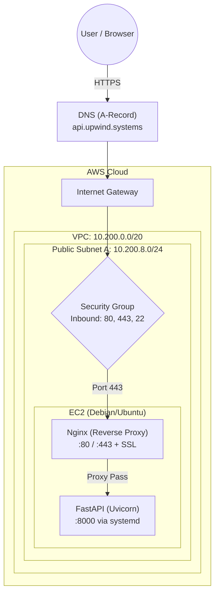

# AWS EC2 Provisioning & Ingress Routing

## 1. Mini-ADR

* **Business Value:** Before automating the cloud infrastructure with Terraform, the foundational AWS network primitives (VPC, Subnets, IGW, Security Groups) must be fully understood and manually verified. This drastically reduces the error rate during subsequent automation.
* **Risk:** "ClickOps" (manual configuration via the AWS UI) is highly error-prone and not reproducible.
* **Cost:** Minimal. We are utilizing a `t3.micro` instance with an 8 GiB `gp3` volume ("Efficiency First" principle).

---

## 2. Architecture Diagram

The traffic flow from the internet down to the isolated Python application:

---

## 3. Implementation Steps

### 3.1 Network Foundation
* Creation of the `main-production` VPC (`10.200.0.0/20`), including an automatic Internet Gateway and Routing Table.
* Creation of Public Subnet A (`10.200.8.0/24`) with automatic Public IPv4 assignment enabled.

### 3.2 Compute Layer & Zero-Touch Provisioning
* **Instance**: `t3.micro` utilizing a Debian AMI.
* **Storage**: 8 GiB `gp3`.
* **Security Group**: `ingress-web-sg` (Port 22 strictly limited to a specific admin IP, Port 80/443 open to `0.0.0.0/0`).
* **Bootstrapping**: Utilization of the `setup_me.sh` script as **AWS User Data**. The script hardens the server on first boot, provisions the `adminsetup` user, pulls authorized GitHub SSH keys, and configures the local UFW firewall.

### 3.3 Routing & DNS
* Configuration of an **A-Record** (`api.upwind.systems`) pointing to the Public IPv4 address of the EC2 instance.
* Verification: `dig api.upwind.systems` confirmed successful global propagation (Status: NOERROR).

### 3.4 Ingress & TLS
* Nginx acts as a reverse proxy to prevent the Uvicorn application server from being directly exposed to the internet.
* Certbot was utilized to generate a Let's Encrypt TLS certificate and strictly redirect all HTTP traffic to HTTPS.
