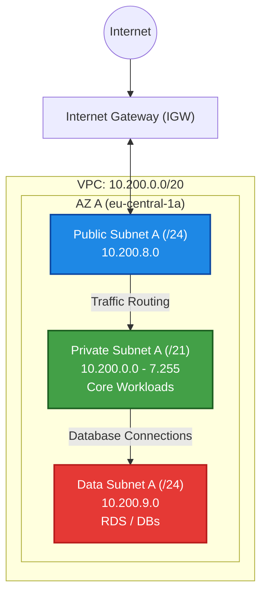

# AWS Network Architecture (VPC)

## Overview
This document describes the network topology for the cloud infrastructure. The design follows the principle of Network Segmentation to isolate public-facing services from internal applications and databases.

* **Region:** `eu-central-1` (Frankfurt)
* **VPC Name:** `main-production-vpc`
* **Total CIDR:** `10.200.0.0/20`
* **Total Available IPs:** 4.096

---

## Subnet Plan (Availability Zone A)

**Tiered Subnet Design**:

| Subnet Name | CIDR Block | IP Range | Hosts (Total) | Zweck |
| :--- | :--- | :--- | :--- | :--- |
| **Private Subnet A** | `10.200.0.0/21` | `10.200.0.0` - `10.200.7.255` | 2.048 | **Application Layer.**  Applications (EC2, EKS Nodes). no internet access (only via NAT). max. size for scaling. |
| **Public Subnet A** | `10.200.8.0/24` | `10.200.8.0` - `10.200.8.255` | 256 | **Ingress Layer.** Load Balancer, Bastion Hosts or NAT gateways. Internet access via IGW. |
| **Data Subnet A** | `10.200.9.0/24` | `10.200.9.0` - `10.200.9.255` | 256 | **Persistence Layer.** DBs (RDS), Redis. Isolated. No internet access. |
| *Reserved* | `10.200.10.0/23`+ | ... | ~1.500 | *Reserved for future expansion or AZ B.* |

---

## Architecture Logic (Mini-ADR)

### Decision: Subnet Sizing
We assigned a /21 block (50% of the total VPC) to the Private Subnet.

* **Reason:** Future-proofing for AWS EKS.
* **Public/Data:** A /24 is sufficient for Ingress and databases at this scale.

---

## Visual Topology (Mermaid)

