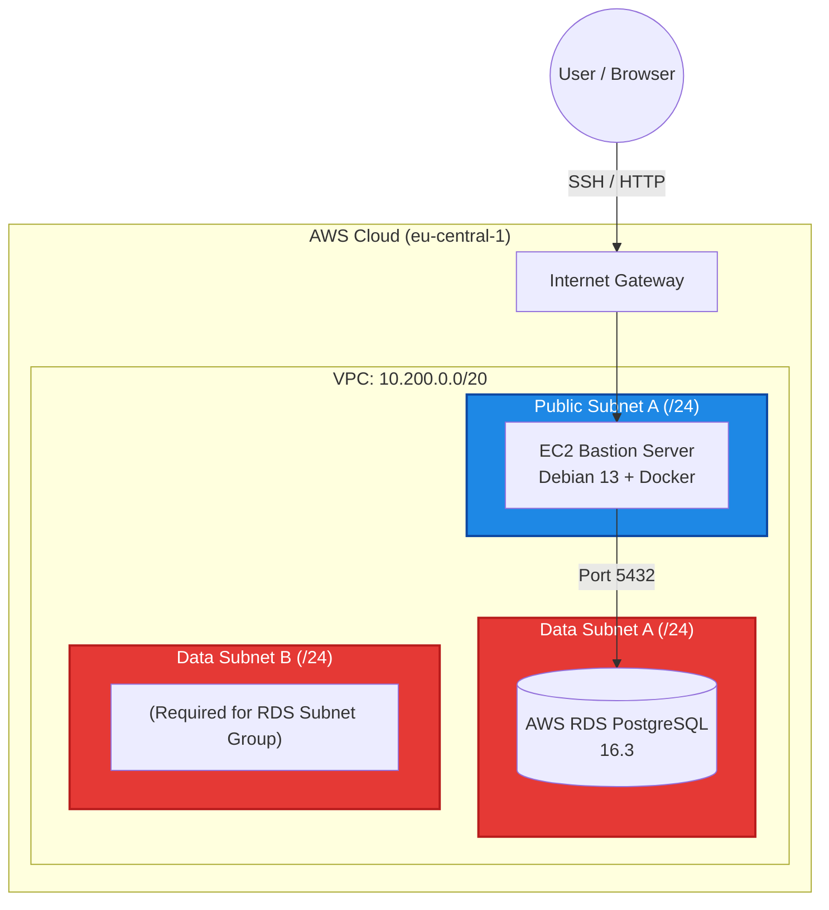

# Infrastructure as Code & Drop-in Replacements

This document details the transition from manual cloud configuration ("ClickOps") to a fully declarative Infrastructure as Code (IaC) approach.

## 1. Architectural Decisions

### OpenTofu over HashiCorp Terraform
* **Decision:** We utilize `OpenTofu` CLI instead of `Terraform` CLI.
* **Context:** Following the 2023 license change by HashiCorp (MPL to BSL), the Linux Foundation forked the project into OpenTofu.
* **Justification:** OpenTofu serves as a 1:1 drop-in replacement. We maintain complete compatibility with existing `.tf` files, the HCL syntax, and the `hashicorp/aws` provider, while adhering to true Open Source principles.

---

## 2. Infrastructure Topology

The code provisions the `main-production-vpc` (`10.200.0.0/20`) and sets up a robust 3-tier architecture.



---

## 3. Implementation Details
### Security Group Referencing
To adhere strictly to the Principle of Least Privilege, the RDS database has `publicly_accessible = false` and possesses no inbound IP rules. Instead, it utilizes Security Group Referencing:

```terraform
ingress {
  description     = "PostgreSQL from App Server"
  from_port       = 5432
  to_port         = 5432
  protocol        = "tcp"
  security_groups = [aws_security_group.app_sg.id] # The "Red VIP Band"
}
```
Only resources explicitly assigned to the `app_sg` (Bastion Host) are permitted to route traffic to the database.

### Input Validation & Secret Management
No secrets or hardcoded IPs are tracked in version control. We utilize a local `terraform.tfvars` file (ignored via .`gitignore`) to inject sensitive data.
Input validation prevents API errors before they reach AWS:

```terraform
variable "home_ip" {
  type = string
  validation {
    condition     = can(cidrhost(var.home_ip, 0))
    error_message = "home_ip must be valid CIDR notation, e.g., 203.0.113.1/32"
  }
}
```

---

## 4. Operational Workflow
The standard deployment lifecycle for this lab environment:

### 1. Verification
```bash
tofu init
tofu plan
```

### 2. Provisioning
```bash
tofu apply -auto-approve
```

### 3. Local Database Access (via SSH Tunnel):
Because the RDS instance is hidden in a private data subnet, local debugging requires port forwarding through the Bastion host:
```bash
ssh -L 5432:<rds-endpoint>:5432 admin@<ec2-public-ip>
```

### 4. Teardown:
```bash
tofu destroy -auto-approve
```
