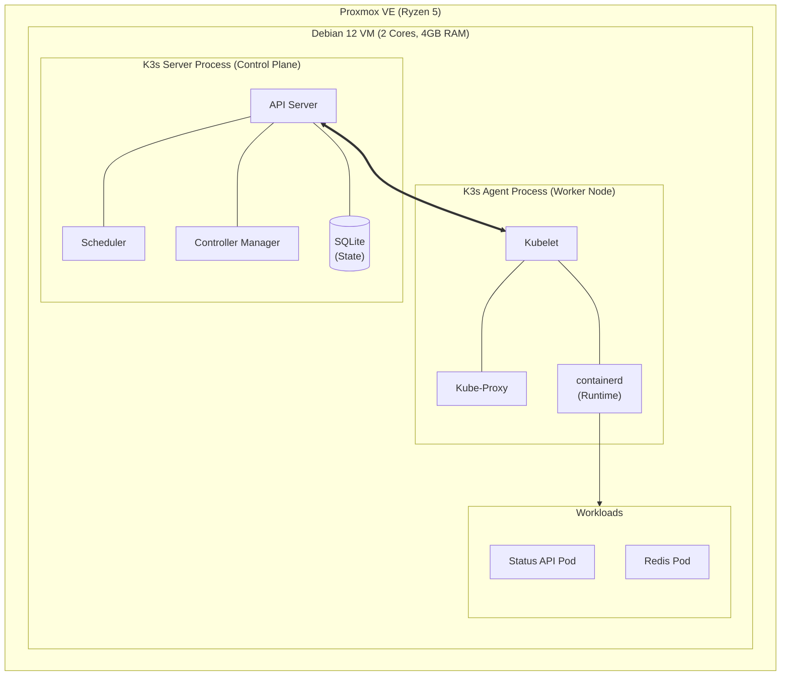

# K3s Architecture on Proxmox

## 1. Concepts over Tools
Standard Kubernetes (K8s) is designed for large-scale deployments. It relies on distributed databases (`etcd`) and multiple independent control-plane processes, which introduce high memory and CPU overhead.

Given our Proxmox host is a resource-constrained Ryzen 5 processor, we utilize **K3s**. K3s is a certified Kubernetes distribution built for IoT and Edge computing.

## 2. The K3s Efficiency Model
K3s achieves its lightweight footprint through several architectural choices:
* **Single Binary:** The API Server, Scheduler, and Controller Manager are packaged into a single binary and run as a single process.
* **Datastore:** It drops `etcd` by default in favor of an embedded SQLite database.
* **Container Runtime:** It natively embeds `containerd`, removing the need for a standalone Docker daemon.

## 3. Architecture Diagram

